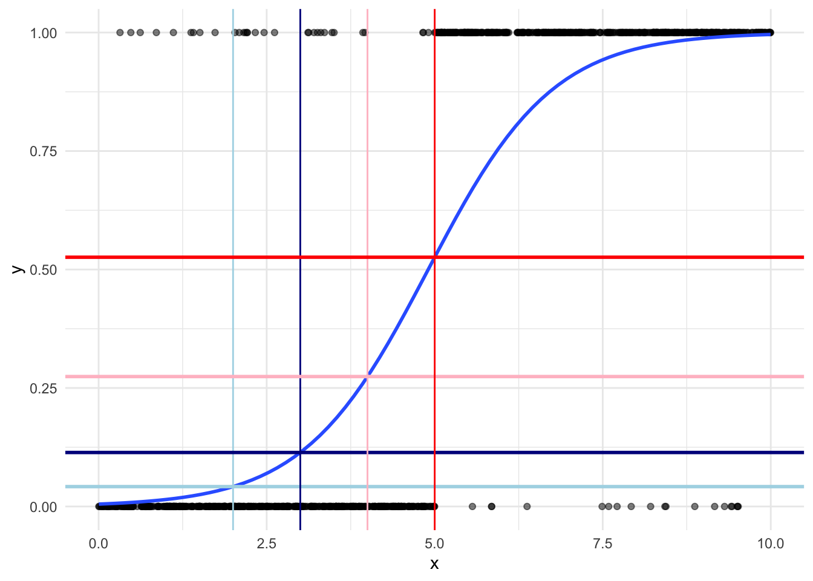
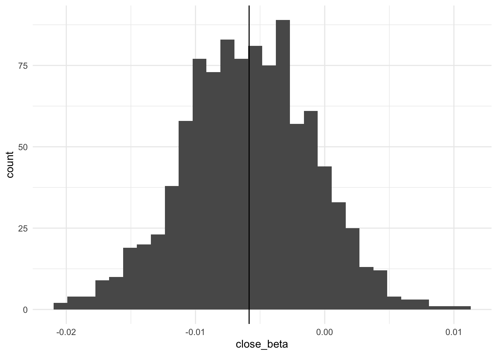
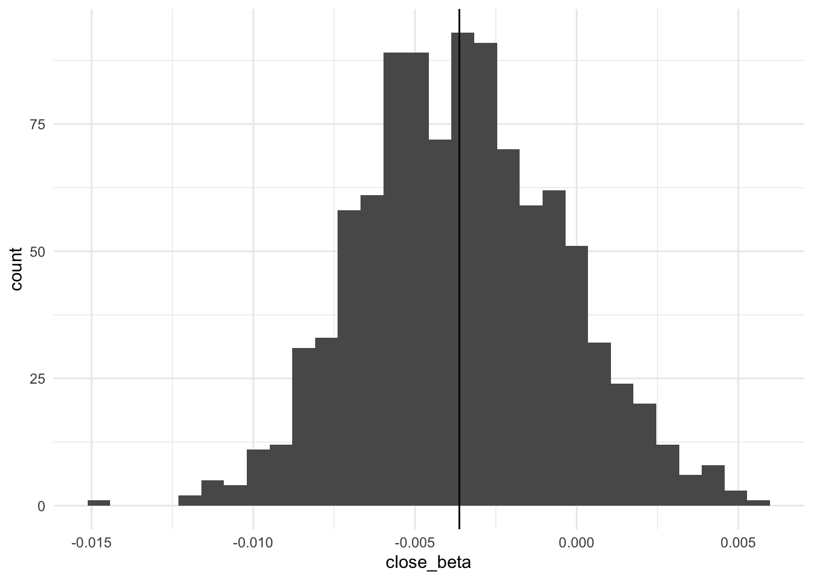

## Set up

This section uses the following packages: 


::: {.cell}

```{.r .cell-code}
library(tidyverse)
library(broom)
library(gtsummary)
library(skimr)
library(mvtnorm)
```
:::


We will use the dataset we set up in the previous section: 


::: {.cell}
::: {.cell-output .cell-output-stdout}
```
   vote close edu7cat       homeown
1 Voted    10       6     Homeowner
2 Voted    29       6     Homeowner
3 Voted    28       4     Homeowner
4 Voted     0       5     Homeowner
5 Voted    25       7 Not homeowner
6 Voted    25       5 Not homeowner
```
:::
:::


## Introduction 

Previously, we explored the effect of a given value of $x_i$ on our expected probability. We are rarely interested in this effect in political science. Rather, we are interested in the effect of a meaningful change in $x_i$ on our expected probability. For example, what is the effect of changing the date of voting registration from 20 days prior to election day to election day? This section will outline how we calculate this **substantive effect** for binary outcomes. 

For non-linear models, we need to specify our values carefully. Unlike linear models, the effect of a one unit change in $x$ on $y$ is not constant. To illustrate, let's look at the effect on the probability of success of moving from $x = 2$ to $x = 3$ compared to the effect of moving from $x = 4$ to $x = 5$: 


::: {.cell}
::: {.cell-output-display}
{width=672}
:::
:::


Moving from $x = 2$ (highlighted in light blue) to $x = 3$ (highlighted in dark blue) increases the probability of success by 0.062, from 0.039 to 0.101. Moving *the same interval* of one unit from $x = 4$ (highlighted in pink) to $x = 5$ (highlighted in red) increases the probability of success by 0.225, from 0.238 to 0.463. That's a 3.623 times increase in the effect of a one unit change in $x$. 

Therefore, to measure the effect of moving from one value of $x$ to another in a non-linear model, we need to know which values of $x$ we are moving between. This should be theoretically driven: what is an interesting interval for the phenomenon you are measuring? 

## Measuring substantive effects

How do we actually measure the effect of a change from $x_{i1}$ to $x_{i2}$? We predict the estimated probability of success at $x_{i1}$ and at $x_{i2}$ and subtract those probabilities from one another to get the difference. Simple, right? However, there are two factors that complicate this process. First, we need to deal with the other variables in our model: what values should they be held at while we change our variable of interest, $x_i$? Second, how do we measure uncertainty surrounding this estimated effect? We will deal with these challenges in turn. 

### What to do with the other independent variables

There are two dominant approaches to solving this challenge: the average case approach and the observed value approach. 

#### Average case approach

This approach sets all other values to their mean (for continuous variables) or mode (for discrete variables).

1.    Find the mean or mode for all independent variables other than your variable of interest. 

2.    Find your predicted probability of success with your first value of $x_i$, holding all other variables at their mean or mode.

3.    Find your predicted probability of success with your second value of $x_i$, holding all other variables at their mean or mode.

4.    Calculate the difference between these predicted probabilities. 

5.    Discuss the substantive significance of this difference. 

To illustrate, let's explore the predicted effect of changing a state's registration voting date from 20 days prior to election day ($close = 20$) to election day ($close = 0$).

First, let's fit a logistic regression as we did in the previous section: 


::: {.cell}

```{.r .cell-code}
m1 <- glm(vote ~ close + edu7cat + homeown, data = voters, family = binomial(link = "logit"))

tbl_regression(m1, intercept = T, exponentiate = T)
```

::: {.cell-output-display}
```{=html}
<div id="opcruhkjnv" style="overflow-x:auto;overflow-y:auto;width:auto;height:auto;">
<style>html {
  font-family: -apple-system, BlinkMacSystemFont, 'Segoe UI', Roboto, Oxygen, Ubuntu, Cantarell, 'Helvetica Neue', 'Fira Sans', 'Droid Sans', Arial, sans-serif;
}

#opcruhkjnv .gt_table {
  display: table;
  border-collapse: collapse;
  margin-left: auto;
  margin-right: auto;
  color: #333333;
  font-size: 16px;
  font-weight: normal;
  font-style: normal;
  background-color: #FFFFFF;
  width: auto;
  border-top-style: solid;
  border-top-width: 2px;
  border-top-color: #A8A8A8;
  border-right-style: none;
  border-right-width: 2px;
  border-right-color: #D3D3D3;
  border-bottom-style: solid;
  border-bottom-width: 2px;
  border-bottom-color: #A8A8A8;
  border-left-style: none;
  border-left-width: 2px;
  border-left-color: #D3D3D3;
}

#opcruhkjnv .gt_heading {
  background-color: #FFFFFF;
  text-align: center;
  border-bottom-color: #FFFFFF;
  border-left-style: none;
  border-left-width: 1px;
  border-left-color: #D3D3D3;
  border-right-style: none;
  border-right-width: 1px;
  border-right-color: #D3D3D3;
}

#opcruhkjnv .gt_title {
  color: #333333;
  font-size: 125%;
  font-weight: initial;
  padding-top: 4px;
  padding-bottom: 4px;
  padding-left: 5px;
  padding-right: 5px;
  border-bottom-color: #FFFFFF;
  border-bottom-width: 0;
}

#opcruhkjnv .gt_subtitle {
  color: #333333;
  font-size: 85%;
  font-weight: initial;
  padding-top: 0;
  padding-bottom: 6px;
  padding-left: 5px;
  padding-right: 5px;
  border-top-color: #FFFFFF;
  border-top-width: 0;
}

#opcruhkjnv .gt_bottom_border {
  border-bottom-style: solid;
  border-bottom-width: 2px;
  border-bottom-color: #D3D3D3;
}

#opcruhkjnv .gt_col_headings {
  border-top-style: solid;
  border-top-width: 2px;
  border-top-color: #D3D3D3;
  border-bottom-style: solid;
  border-bottom-width: 2px;
  border-bottom-color: #D3D3D3;
  border-left-style: none;
  border-left-width: 1px;
  border-left-color: #D3D3D3;
  border-right-style: none;
  border-right-width: 1px;
  border-right-color: #D3D3D3;
}

#opcruhkjnv .gt_col_heading {
  color: #333333;
  background-color: #FFFFFF;
  font-size: 100%;
  font-weight: normal;
  text-transform: inherit;
  border-left-style: none;
  border-left-width: 1px;
  border-left-color: #D3D3D3;
  border-right-style: none;
  border-right-width: 1px;
  border-right-color: #D3D3D3;
  vertical-align: bottom;
  padding-top: 5px;
  padding-bottom: 6px;
  padding-left: 5px;
  padding-right: 5px;
  overflow-x: hidden;
}

#opcruhkjnv .gt_column_spanner_outer {
  color: #333333;
  background-color: #FFFFFF;
  font-size: 100%;
  font-weight: normal;
  text-transform: inherit;
  padding-top: 0;
  padding-bottom: 0;
  padding-left: 4px;
  padding-right: 4px;
}

#opcruhkjnv .gt_column_spanner_outer:first-child {
  padding-left: 0;
}

#opcruhkjnv .gt_column_spanner_outer:last-child {
  padding-right: 0;
}

#opcruhkjnv .gt_column_spanner {
  border-bottom-style: solid;
  border-bottom-width: 2px;
  border-bottom-color: #D3D3D3;
  vertical-align: bottom;
  padding-top: 5px;
  padding-bottom: 5px;
  overflow-x: hidden;
  display: inline-block;
  width: 100%;
}

#opcruhkjnv .gt_group_heading {
  padding-top: 8px;
  padding-bottom: 8px;
  padding-left: 5px;
  padding-right: 5px;
  color: #333333;
  background-color: #FFFFFF;
  font-size: 100%;
  font-weight: initial;
  text-transform: inherit;
  border-top-style: solid;
  border-top-width: 2px;
  border-top-color: #D3D3D3;
  border-bottom-style: solid;
  border-bottom-width: 2px;
  border-bottom-color: #D3D3D3;
  border-left-style: none;
  border-left-width: 1px;
  border-left-color: #D3D3D3;
  border-right-style: none;
  border-right-width: 1px;
  border-right-color: #D3D3D3;
  vertical-align: middle;
}

#opcruhkjnv .gt_empty_group_heading {
  padding: 0.5px;
  color: #333333;
  background-color: #FFFFFF;
  font-size: 100%;
  font-weight: initial;
  border-top-style: solid;
  border-top-width: 2px;
  border-top-color: #D3D3D3;
  border-bottom-style: solid;
  border-bottom-width: 2px;
  border-bottom-color: #D3D3D3;
  vertical-align: middle;
}

#opcruhkjnv .gt_from_md > :first-child {
  margin-top: 0;
}

#opcruhkjnv .gt_from_md > :last-child {
  margin-bottom: 0;
}

#opcruhkjnv .gt_row {
  padding-top: 8px;
  padding-bottom: 8px;
  padding-left: 5px;
  padding-right: 5px;
  margin: 10px;
  border-top-style: solid;
  border-top-width: 1px;
  border-top-color: #D3D3D3;
  border-left-style: none;
  border-left-width: 1px;
  border-left-color: #D3D3D3;
  border-right-style: none;
  border-right-width: 1px;
  border-right-color: #D3D3D3;
  vertical-align: middle;
  overflow-x: hidden;
}

#opcruhkjnv .gt_stub {
  color: #333333;
  background-color: #FFFFFF;
  font-size: 100%;
  font-weight: initial;
  text-transform: inherit;
  border-right-style: solid;
  border-right-width: 2px;
  border-right-color: #D3D3D3;
  padding-left: 5px;
  padding-right: 5px;
}

#opcruhkjnv .gt_stub_row_group {
  color: #333333;
  background-color: #FFFFFF;
  font-size: 100%;
  font-weight: initial;
  text-transform: inherit;
  border-right-style: solid;
  border-right-width: 2px;
  border-right-color: #D3D3D3;
  padding-left: 5px;
  padding-right: 5px;
  vertical-align: top;
}

#opcruhkjnv .gt_row_group_first td {
  border-top-width: 2px;
}

#opcruhkjnv .gt_summary_row {
  color: #333333;
  background-color: #FFFFFF;
  text-transform: inherit;
  padding-top: 8px;
  padding-bottom: 8px;
  padding-left: 5px;
  padding-right: 5px;
}

#opcruhkjnv .gt_first_summary_row {
  border-top-style: solid;
  border-top-color: #D3D3D3;
}

#opcruhkjnv .gt_first_summary_row.thick {
  border-top-width: 2px;
}

#opcruhkjnv .gt_last_summary_row {
  padding-top: 8px;
  padding-bottom: 8px;
  padding-left: 5px;
  padding-right: 5px;
  border-bottom-style: solid;
  border-bottom-width: 2px;
  border-bottom-color: #D3D3D3;
}

#opcruhkjnv .gt_grand_summary_row {
  color: #333333;
  background-color: #FFFFFF;
  text-transform: inherit;
  padding-top: 8px;
  padding-bottom: 8px;
  padding-left: 5px;
  padding-right: 5px;
}

#opcruhkjnv .gt_first_grand_summary_row {
  padding-top: 8px;
  padding-bottom: 8px;
  padding-left: 5px;
  padding-right: 5px;
  border-top-style: double;
  border-top-width: 6px;
  border-top-color: #D3D3D3;
}

#opcruhkjnv .gt_striped {
  background-color: rgba(128, 128, 128, 0.05);
}

#opcruhkjnv .gt_table_body {
  border-top-style: solid;
  border-top-width: 2px;
  border-top-color: #D3D3D3;
  border-bottom-style: solid;
  border-bottom-width: 2px;
  border-bottom-color: #D3D3D3;
}

#opcruhkjnv .gt_footnotes {
  color: #333333;
  background-color: #FFFFFF;
  border-bottom-style: none;
  border-bottom-width: 2px;
  border-bottom-color: #D3D3D3;
  border-left-style: none;
  border-left-width: 2px;
  border-left-color: #D3D3D3;
  border-right-style: none;
  border-right-width: 2px;
  border-right-color: #D3D3D3;
}

#opcruhkjnv .gt_footnote {
  margin: 0px;
  font-size: 90%;
  padding-left: 4px;
  padding-right: 4px;
  padding-left: 5px;
  padding-right: 5px;
}

#opcruhkjnv .gt_sourcenotes {
  color: #333333;
  background-color: #FFFFFF;
  border-bottom-style: none;
  border-bottom-width: 2px;
  border-bottom-color: #D3D3D3;
  border-left-style: none;
  border-left-width: 2px;
  border-left-color: #D3D3D3;
  border-right-style: none;
  border-right-width: 2px;
  border-right-color: #D3D3D3;
}

#opcruhkjnv .gt_sourcenote {
  font-size: 90%;
  padding-top: 4px;
  padding-bottom: 4px;
  padding-left: 5px;
  padding-right: 5px;
}

#opcruhkjnv .gt_left {
  text-align: left;
}

#opcruhkjnv .gt_center {
  text-align: center;
}

#opcruhkjnv .gt_right {
  text-align: right;
  font-variant-numeric: tabular-nums;
}

#opcruhkjnv .gt_font_normal {
  font-weight: normal;
}

#opcruhkjnv .gt_font_bold {
  font-weight: bold;
}

#opcruhkjnv .gt_font_italic {
  font-style: italic;
}

#opcruhkjnv .gt_super {
  font-size: 65%;
}

#opcruhkjnv .gt_footnote_marks {
  font-style: italic;
  font-weight: normal;
  font-size: 75%;
  vertical-align: 0.4em;
}

#opcruhkjnv .gt_asterisk {
  font-size: 100%;
  vertical-align: 0;
}

#opcruhkjnv .gt_indent_1 {
  text-indent: 5px;
}

#opcruhkjnv .gt_indent_2 {
  text-indent: 10px;
}

#opcruhkjnv .gt_indent_3 {
  text-indent: 15px;
}

#opcruhkjnv .gt_indent_4 {
  text-indent: 20px;
}

#opcruhkjnv .gt_indent_5 {
  text-indent: 25px;
}
</style>
<table class="gt_table">
  
  <thead class="gt_col_headings">
    <tr>
      <th class="gt_col_heading gt_columns_bottom_border gt_left" rowspan="1" colspan="1" scope="col"><strong>Characteristic</strong></th>
      <th class="gt_col_heading gt_columns_bottom_border gt_center" rowspan="1" colspan="1" scope="col"><strong>OR</strong><sup class="gt_footnote_marks">1</sup></th>
      <th class="gt_col_heading gt_columns_bottom_border gt_center" rowspan="1" colspan="1" scope="col"><strong>95% CI</strong><sup class="gt_footnote_marks">1</sup></th>
      <th class="gt_col_heading gt_columns_bottom_border gt_center" rowspan="1" colspan="1" scope="col"><strong>p-value</strong></th>
    </tr>
  </thead>
  <tbody class="gt_table_body">
    <tr><td class="gt_row gt_left">(Intercept)</td>
<td class="gt_row gt_center">0.45</td>
<td class="gt_row gt_center">0.11, 1.56</td>
<td class="gt_row gt_center">0.2</td></tr>
    <tr><td class="gt_row gt_left">Registration closing</td>
<td class="gt_row gt_center">0.99</td>
<td class="gt_row gt_center">0.98, 1.00</td>
<td class="gt_row gt_center">0.2</td></tr>
    <tr><td class="gt_row gt_left">Education level</td>
<td class="gt_row gt_center"></td>
<td class="gt_row gt_center"></td>
<td class="gt_row gt_center"></td></tr>
    <tr><td class="gt_row gt_left" style="text-align: left; text-indent: 10px;">1</td>
<td class="gt_row gt_center">—</td>
<td class="gt_row gt_center">—</td>
<td class="gt_row gt_center"></td></tr>
    <tr><td class="gt_row gt_left" style="text-align: left; text-indent: 10px;">2</td>
<td class="gt_row gt_center">1.59</td>
<td class="gt_row gt_center">0.43, 6.60</td>
<td class="gt_row gt_center">0.5</td></tr>
    <tr><td class="gt_row gt_left" style="text-align: left; text-indent: 10px;">3</td>
<td class="gt_row gt_center">1.24</td>
<td class="gt_row gt_center">0.35, 4.96</td>
<td class="gt_row gt_center">0.7</td></tr>
    <tr><td class="gt_row gt_left" style="text-align: left; text-indent: 10px;">4</td>
<td class="gt_row gt_center">1.66</td>
<td class="gt_row gt_center">0.48, 6.54</td>
<td class="gt_row gt_center">0.4</td></tr>
    <tr><td class="gt_row gt_left" style="text-align: left; text-indent: 10px;">5</td>
<td class="gt_row gt_center">3.46</td>
<td class="gt_row gt_center">1.00, 13.6</td>
<td class="gt_row gt_center">0.055</td></tr>
    <tr><td class="gt_row gt_left" style="text-align: left; text-indent: 10px;">6</td>
<td class="gt_row gt_center">6.86</td>
<td class="gt_row gt_center">1.95, 27.4</td>
<td class="gt_row gt_center">0.003</td></tr>
    <tr><td class="gt_row gt_left" style="text-align: left; text-indent: 10px;">7</td>
<td class="gt_row gt_center">9.13</td>
<td class="gt_row gt_center">2.49, 38.0</td>
<td class="gt_row gt_center">0.001</td></tr>
    <tr><td class="gt_row gt_left">Homeownership</td>
<td class="gt_row gt_center"></td>
<td class="gt_row gt_center"></td>
<td class="gt_row gt_center"></td></tr>
    <tr><td class="gt_row gt_left" style="text-align: left; text-indent: 10px;">Not homeowner</td>
<td class="gt_row gt_center">—</td>
<td class="gt_row gt_center">—</td>
<td class="gt_row gt_center"></td></tr>
    <tr><td class="gt_row gt_left" style="text-align: left; text-indent: 10px;">Homeowner</td>
<td class="gt_row gt_center">2.28</td>
<td class="gt_row gt_center">1.85, 2.83</td>
<td class="gt_row gt_center"><0.001</td></tr>
  </tbody>
  
  <tfoot class="gt_footnotes">
    <tr>
      <td class="gt_footnote" colspan="4"><sup class="gt_footnote_marks">1</sup> OR = Odds Ratio, CI = Confidence Interval</td>
    </tr>
  </tfoot>
</table>
</div>
```
:::
:::


Now, we create a new dataset that contains the values for `close` we want to test and sets the other independent variables to their mean or mode values: 


::: {.cell}

```{.r .cell-code}
new_data <- tibble(
  close = c(0, 20),
  edu7cat = voters |> count(edu7cat) |> filter(n == max(n)) |> pull(edu7cat),
  homeown = voters |> count(homeown) |> filter(n == max(n)) |> pull(homeown)
)

new_data
```

::: {.cell-output .cell-output-stdout}
```
# A tibble: 2 × 3
  close edu7cat homeown  
  <dbl> <fct>   <fct>    
1     0 4       Homeowner
2    20 4       Homeowner
```
:::
:::


Next, we calculate the predicted probability that an individual will vote, given these values for our independent variables:


::: {.cell}

```{.r .cell-code}
result <- augment(m1, newdata = new_data, type.predict = "response")
result
```

::: {.cell-output .cell-output-stdout}
```
# A tibble: 2 × 4
  close edu7cat homeown   .fitted
  <dbl> <fct>   <fct>       <dbl>
1     0 4       Homeowner   0.629
2    20 4       Homeowner   0.601
```
:::
:::


Next, we calculate the difference between these predicted probabilities, noting that the only thing that changed in our model is the value of `close`: 


::: {.cell}

```{.r .cell-code}
result <- mutate(result, diff = (.fitted - lead(.fitted)) * 100)
result
```

::: {.cell-output .cell-output-stdout}
```
# A tibble: 2 × 5
  close edu7cat homeown   .fitted  diff
  <dbl> <fct>   <fct>       <dbl> <dbl>
1     0 4       Homeowner   0.629  2.77
2    20 4       Homeowner   0.601 NA   
```
:::
:::


We expect that the probability that an individual will vote increases 2.77 percentage points when a state's closing date for voter registration moves from 20 days prior to election day to election day. If increasing turnout by 2.77 percentage points would swing an election in a candidate's favour, this is a substantively significant result.[^1]

[^1]: This is only one interpretation of substantive significance. This should be theoretically (or policy) driven.

However, we have a bit of a problem. Is this really a generalisable result? Haven't we just estimated the effect of this change in registration day closure for a homeowner with an education level of 4? This is the problem with the average case approach: we are discarding an enormous amount of rich data from our sample which is potentially compromising the generalisability of our estimates. In fact, sometimes our average case isn't even in our dataset, which means that we are making out-of-sample predictions.

#### Observed value approach

The observed value approach addresses this issue. It sets all other independent variables to their observed values, only aggregating the estimated effect at the end. 

1.    Find your predicted probability of success with your first value of $x_i$, holding all other variables at their observed values. You will get the same number of predictions as you have observations. 

2.    Find your predicted probability of success with your second value of $x_i$, holding all other variables at their observed values.

3.    Calculate the average predicted probability for each of these values of $x_i$. 

4.    Calculate the difference between these averages. 

5.    Discuss the substantive significance of this difference. 

Let's explore the same question as above to illustrate. 

First, find the predicted probability of an individual voting when $close = 20$: 


::: {.cell}

```{.r .cell-code}
result_20 <- augment(m1, newdata = mutate(voters, close = 20), type.predict = "response")
result_20
```

::: {.cell-output .cell-output-stdout}
```
# A tibble: 2,188 × 5
   vote         close edu7cat homeown       .fitted
   <fct>        <dbl> <fct>   <fct>           <dbl>
 1 Voted           20 6       Homeowner       0.861
 2 Voted           20 6       Homeowner       0.861
 3 Voted           20 4       Homeowner       0.601
 4 Voted           20 5       Homeowner       0.758
 5 Voted           20 7       Not homeowner   0.784
 6 Voted           20 5       Not homeowner   0.579
 7 Voted           20 7       Homeowner       0.892
 8 Voted           20 6       Homeowner       0.861
 9 Voted           20 2       Homeowner       0.590
10 Did not vote    20 5       Homeowner       0.758
# … with 2,178 more rows
```
:::
:::


Next, find the predicted probability of an individual voting when $close = 0$: 


::: {.cell}

```{.r .cell-code}
result_0 <- augment(m1, newdata = mutate(voters, close = 0), type.predict = "response")
result_0
```

::: {.cell-output .cell-output-stdout}
```
# A tibble: 2,188 × 5
   vote         close edu7cat homeown       .fitted
   <fct>        <dbl> <fct>   <fct>           <dbl>
 1 Voted            0 6       Homeowner       0.875
 2 Voted            0 6       Homeowner       0.875
 3 Voted            0 4       Homeowner       0.629
 4 Voted            0 5       Homeowner       0.779
 5 Voted            0 7       Not homeowner   0.803
 6 Voted            0 5       Not homeowner   0.607
 7 Voted            0 7       Homeowner       0.903
 8 Voted            0 6       Homeowner       0.875
 9 Voted            0 2       Homeowner       0.618
10 Did not vote     0 5       Homeowner       0.779
# … with 2,178 more rows
```
:::
:::


Next, calculate the average predicted probability for $close = 20$ and $close = 0$:


::: {.cell}

```{.r .cell-code}
result <- result_0 |> 
  bind_rows(result_20) |> 
  group_by(close) |> 
  summarise(.fitted = mean(.fitted)) |> 
  mutate(diff = (.fitted - lead(.fitted)) * 100)

result
```

::: {.cell-output .cell-output-stdout}
```
# A tibble: 2 × 3
  close .fitted  diff
  <dbl>   <dbl> <dbl>
1     0   0.688  2.28
2    20   0.666 NA   
```
:::
:::


We expect that the probability that an individual will vote increases 2.28 percentage points when a state's closing date for voter registration moves from 20 days prior to election day to election day. If this increase in turnout would swing an election in a candidate's favour, this is a substantively significant result.

#### Which approach should you use?

You should use the observed values approach. Hanmer and Kalkan (2013) demonstrate using simulated data that the observed values approach consistently produces estimates closer to the population's true probability than the average case approach. This makes sense: you are using more data to produce your estimated effects.  

### Measuring uncertainty when calculating substantive effects

We calculated these estimates using a model that includes error. We need to understand how this uncertainty impacts our estimated substantive effects. How do we get confidence intervals around our estimated effects? 

First, we need to go back to the fundamentals of our logistic or probit regression models. Remember from the first section that the latent variable approach assumes there is some continuous process that gets us from $y = 0$ to $y = 1$ based on some set of independent variables $X$. This latent variable, $z_i$, is modelled as: 


$$
z_i = \beta_0 + X_i\beta_i + \epsilon_i
$$


It contains an error term: $\epsilon_i$. What that error looks like depends on whether you use a logistic or probit regression, but they are very similar. That error term applies to both $X_i$ and $\beta_i$. So, we need to generate a series of estimates for both the $X_i$ and $\beta_i$ to generate our confidence intervals. 

Imagine we are trying to estimate the relationship between some binary outcome $y$ and some independent variables $x$ and $z$. We take a representative sample from our population and fit a model against that data. If we were to take a different representative sample from our population and fit the same model to that data, we will probably get slightly different estimates for our $\beta$s. This is because of the random error inherent in observational modelling. The idea behind logistic and probit regression is that if we were to do this many, many, many times (say, take 1,000 different representative samples from our population and use that data to fit 1,000 models) we would get a set of $\beta$ estimates that follow a normal (if you're using a probit model) or inverse logistic (if you're using a logistic model) distribution. Your original estimated $\beta$ will be within this distribution.  

We can use this assumption to generate our confidence intervals. We just need to simulate fitting these 1,000 different models.  

> It is critical that your sample is representative of your population. We are not simulating drawing 1,000 different samples. Rather, we are taking our one model fitted against our one sample and drawing estimates around those $\beta$s. 

1.    Simulate fitting 1,000 different models by drawing 1,000 different $\beta_i$ around your estimated $\beta_i$ following your (logistic or probit) model's distribution.

2.    Predict the probability of success for $x_{i1}$ and $x_{i2}$ using these 1,000 different model estimates.

3.    Calculate the difference between those predictions. 

4.    Calculate the lower and upper confidence intervals and the mean of those differences. 

Let's illustrate this by looking at our question above. 

#### Logistic regression

Recall our logistic regression model from above:


::: {.cell}

```{.r .cell-code}
tbl_regression(m1, intercept = T, exponentiate = T)
```

::: {.cell-output-display}
```{=html}
<div id="bivdbrftkr" style="overflow-x:auto;overflow-y:auto;width:auto;height:auto;">
<style>html {
  font-family: -apple-system, BlinkMacSystemFont, 'Segoe UI', Roboto, Oxygen, Ubuntu, Cantarell, 'Helvetica Neue', 'Fira Sans', 'Droid Sans', Arial, sans-serif;
}

#bivdbrftkr .gt_table {
  display: table;
  border-collapse: collapse;
  margin-left: auto;
  margin-right: auto;
  color: #333333;
  font-size: 16px;
  font-weight: normal;
  font-style: normal;
  background-color: #FFFFFF;
  width: auto;
  border-top-style: solid;
  border-top-width: 2px;
  border-top-color: #A8A8A8;
  border-right-style: none;
  border-right-width: 2px;
  border-right-color: #D3D3D3;
  border-bottom-style: solid;
  border-bottom-width: 2px;
  border-bottom-color: #A8A8A8;
  border-left-style: none;
  border-left-width: 2px;
  border-left-color: #D3D3D3;
}

#bivdbrftkr .gt_heading {
  background-color: #FFFFFF;
  text-align: center;
  border-bottom-color: #FFFFFF;
  border-left-style: none;
  border-left-width: 1px;
  border-left-color: #D3D3D3;
  border-right-style: none;
  border-right-width: 1px;
  border-right-color: #D3D3D3;
}

#bivdbrftkr .gt_title {
  color: #333333;
  font-size: 125%;
  font-weight: initial;
  padding-top: 4px;
  padding-bottom: 4px;
  padding-left: 5px;
  padding-right: 5px;
  border-bottom-color: #FFFFFF;
  border-bottom-width: 0;
}

#bivdbrftkr .gt_subtitle {
  color: #333333;
  font-size: 85%;
  font-weight: initial;
  padding-top: 0;
  padding-bottom: 6px;
  padding-left: 5px;
  padding-right: 5px;
  border-top-color: #FFFFFF;
  border-top-width: 0;
}

#bivdbrftkr .gt_bottom_border {
  border-bottom-style: solid;
  border-bottom-width: 2px;
  border-bottom-color: #D3D3D3;
}

#bivdbrftkr .gt_col_headings {
  border-top-style: solid;
  border-top-width: 2px;
  border-top-color: #D3D3D3;
  border-bottom-style: solid;
  border-bottom-width: 2px;
  border-bottom-color: #D3D3D3;
  border-left-style: none;
  border-left-width: 1px;
  border-left-color: #D3D3D3;
  border-right-style: none;
  border-right-width: 1px;
  border-right-color: #D3D3D3;
}

#bivdbrftkr .gt_col_heading {
  color: #333333;
  background-color: #FFFFFF;
  font-size: 100%;
  font-weight: normal;
  text-transform: inherit;
  border-left-style: none;
  border-left-width: 1px;
  border-left-color: #D3D3D3;
  border-right-style: none;
  border-right-width: 1px;
  border-right-color: #D3D3D3;
  vertical-align: bottom;
  padding-top: 5px;
  padding-bottom: 6px;
  padding-left: 5px;
  padding-right: 5px;
  overflow-x: hidden;
}

#bivdbrftkr .gt_column_spanner_outer {
  color: #333333;
  background-color: #FFFFFF;
  font-size: 100%;
  font-weight: normal;
  text-transform: inherit;
  padding-top: 0;
  padding-bottom: 0;
  padding-left: 4px;
  padding-right: 4px;
}

#bivdbrftkr .gt_column_spanner_outer:first-child {
  padding-left: 0;
}

#bivdbrftkr .gt_column_spanner_outer:last-child {
  padding-right: 0;
}

#bivdbrftkr .gt_column_spanner {
  border-bottom-style: solid;
  border-bottom-width: 2px;
  border-bottom-color: #D3D3D3;
  vertical-align: bottom;
  padding-top: 5px;
  padding-bottom: 5px;
  overflow-x: hidden;
  display: inline-block;
  width: 100%;
}

#bivdbrftkr .gt_group_heading {
  padding-top: 8px;
  padding-bottom: 8px;
  padding-left: 5px;
  padding-right: 5px;
  color: #333333;
  background-color: #FFFFFF;
  font-size: 100%;
  font-weight: initial;
  text-transform: inherit;
  border-top-style: solid;
  border-top-width: 2px;
  border-top-color: #D3D3D3;
  border-bottom-style: solid;
  border-bottom-width: 2px;
  border-bottom-color: #D3D3D3;
  border-left-style: none;
  border-left-width: 1px;
  border-left-color: #D3D3D3;
  border-right-style: none;
  border-right-width: 1px;
  border-right-color: #D3D3D3;
  vertical-align: middle;
}

#bivdbrftkr .gt_empty_group_heading {
  padding: 0.5px;
  color: #333333;
  background-color: #FFFFFF;
  font-size: 100%;
  font-weight: initial;
  border-top-style: solid;
  border-top-width: 2px;
  border-top-color: #D3D3D3;
  border-bottom-style: solid;
  border-bottom-width: 2px;
  border-bottom-color: #D3D3D3;
  vertical-align: middle;
}

#bivdbrftkr .gt_from_md > :first-child {
  margin-top: 0;
}

#bivdbrftkr .gt_from_md > :last-child {
  margin-bottom: 0;
}

#bivdbrftkr .gt_row {
  padding-top: 8px;
  padding-bottom: 8px;
  padding-left: 5px;
  padding-right: 5px;
  margin: 10px;
  border-top-style: solid;
  border-top-width: 1px;
  border-top-color: #D3D3D3;
  border-left-style: none;
  border-left-width: 1px;
  border-left-color: #D3D3D3;
  border-right-style: none;
  border-right-width: 1px;
  border-right-color: #D3D3D3;
  vertical-align: middle;
  overflow-x: hidden;
}

#bivdbrftkr .gt_stub {
  color: #333333;
  background-color: #FFFFFF;
  font-size: 100%;
  font-weight: initial;
  text-transform: inherit;
  border-right-style: solid;
  border-right-width: 2px;
  border-right-color: #D3D3D3;
  padding-left: 5px;
  padding-right: 5px;
}

#bivdbrftkr .gt_stub_row_group {
  color: #333333;
  background-color: #FFFFFF;
  font-size: 100%;
  font-weight: initial;
  text-transform: inherit;
  border-right-style: solid;
  border-right-width: 2px;
  border-right-color: #D3D3D3;
  padding-left: 5px;
  padding-right: 5px;
  vertical-align: top;
}

#bivdbrftkr .gt_row_group_first td {
  border-top-width: 2px;
}

#bivdbrftkr .gt_summary_row {
  color: #333333;
  background-color: #FFFFFF;
  text-transform: inherit;
  padding-top: 8px;
  padding-bottom: 8px;
  padding-left: 5px;
  padding-right: 5px;
}

#bivdbrftkr .gt_first_summary_row {
  border-top-style: solid;
  border-top-color: #D3D3D3;
}

#bivdbrftkr .gt_first_summary_row.thick {
  border-top-width: 2px;
}

#bivdbrftkr .gt_last_summary_row {
  padding-top: 8px;
  padding-bottom: 8px;
  padding-left: 5px;
  padding-right: 5px;
  border-bottom-style: solid;
  border-bottom-width: 2px;
  border-bottom-color: #D3D3D3;
}

#bivdbrftkr .gt_grand_summary_row {
  color: #333333;
  background-color: #FFFFFF;
  text-transform: inherit;
  padding-top: 8px;
  padding-bottom: 8px;
  padding-left: 5px;
  padding-right: 5px;
}

#bivdbrftkr .gt_first_grand_summary_row {
  padding-top: 8px;
  padding-bottom: 8px;
  padding-left: 5px;
  padding-right: 5px;
  border-top-style: double;
  border-top-width: 6px;
  border-top-color: #D3D3D3;
}

#bivdbrftkr .gt_striped {
  background-color: rgba(128, 128, 128, 0.05);
}

#bivdbrftkr .gt_table_body {
  border-top-style: solid;
  border-top-width: 2px;
  border-top-color: #D3D3D3;
  border-bottom-style: solid;
  border-bottom-width: 2px;
  border-bottom-color: #D3D3D3;
}

#bivdbrftkr .gt_footnotes {
  color: #333333;
  background-color: #FFFFFF;
  border-bottom-style: none;
  border-bottom-width: 2px;
  border-bottom-color: #D3D3D3;
  border-left-style: none;
  border-left-width: 2px;
  border-left-color: #D3D3D3;
  border-right-style: none;
  border-right-width: 2px;
  border-right-color: #D3D3D3;
}

#bivdbrftkr .gt_footnote {
  margin: 0px;
  font-size: 90%;
  padding-left: 4px;
  padding-right: 4px;
  padding-left: 5px;
  padding-right: 5px;
}

#bivdbrftkr .gt_sourcenotes {
  color: #333333;
  background-color: #FFFFFF;
  border-bottom-style: none;
  border-bottom-width: 2px;
  border-bottom-color: #D3D3D3;
  border-left-style: none;
  border-left-width: 2px;
  border-left-color: #D3D3D3;
  border-right-style: none;
  border-right-width: 2px;
  border-right-color: #D3D3D3;
}

#bivdbrftkr .gt_sourcenote {
  font-size: 90%;
  padding-top: 4px;
  padding-bottom: 4px;
  padding-left: 5px;
  padding-right: 5px;
}

#bivdbrftkr .gt_left {
  text-align: left;
}

#bivdbrftkr .gt_center {
  text-align: center;
}

#bivdbrftkr .gt_right {
  text-align: right;
  font-variant-numeric: tabular-nums;
}

#bivdbrftkr .gt_font_normal {
  font-weight: normal;
}

#bivdbrftkr .gt_font_bold {
  font-weight: bold;
}

#bivdbrftkr .gt_font_italic {
  font-style: italic;
}

#bivdbrftkr .gt_super {
  font-size: 65%;
}

#bivdbrftkr .gt_footnote_marks {
  font-style: italic;
  font-weight: normal;
  font-size: 75%;
  vertical-align: 0.4em;
}

#bivdbrftkr .gt_asterisk {
  font-size: 100%;
  vertical-align: 0;
}

#bivdbrftkr .gt_indent_1 {
  text-indent: 5px;
}

#bivdbrftkr .gt_indent_2 {
  text-indent: 10px;
}

#bivdbrftkr .gt_indent_3 {
  text-indent: 15px;
}

#bivdbrftkr .gt_indent_4 {
  text-indent: 20px;
}

#bivdbrftkr .gt_indent_5 {
  text-indent: 25px;
}
</style>
<table class="gt_table">
  
  <thead class="gt_col_headings">
    <tr>
      <th class="gt_col_heading gt_columns_bottom_border gt_left" rowspan="1" colspan="1" scope="col"><strong>Characteristic</strong></th>
      <th class="gt_col_heading gt_columns_bottom_border gt_center" rowspan="1" colspan="1" scope="col"><strong>OR</strong><sup class="gt_footnote_marks">1</sup></th>
      <th class="gt_col_heading gt_columns_bottom_border gt_center" rowspan="1" colspan="1" scope="col"><strong>95% CI</strong><sup class="gt_footnote_marks">1</sup></th>
      <th class="gt_col_heading gt_columns_bottom_border gt_center" rowspan="1" colspan="1" scope="col"><strong>p-value</strong></th>
    </tr>
  </thead>
  <tbody class="gt_table_body">
    <tr><td class="gt_row gt_left">(Intercept)</td>
<td class="gt_row gt_center">0.45</td>
<td class="gt_row gt_center">0.11, 1.56</td>
<td class="gt_row gt_center">0.2</td></tr>
    <tr><td class="gt_row gt_left">Registration closing</td>
<td class="gt_row gt_center">0.99</td>
<td class="gt_row gt_center">0.98, 1.00</td>
<td class="gt_row gt_center">0.2</td></tr>
    <tr><td class="gt_row gt_left">Education level</td>
<td class="gt_row gt_center"></td>
<td class="gt_row gt_center"></td>
<td class="gt_row gt_center"></td></tr>
    <tr><td class="gt_row gt_left" style="text-align: left; text-indent: 10px;">1</td>
<td class="gt_row gt_center">—</td>
<td class="gt_row gt_center">—</td>
<td class="gt_row gt_center"></td></tr>
    <tr><td class="gt_row gt_left" style="text-align: left; text-indent: 10px;">2</td>
<td class="gt_row gt_center">1.59</td>
<td class="gt_row gt_center">0.43, 6.60</td>
<td class="gt_row gt_center">0.5</td></tr>
    <tr><td class="gt_row gt_left" style="text-align: left; text-indent: 10px;">3</td>
<td class="gt_row gt_center">1.24</td>
<td class="gt_row gt_center">0.35, 4.96</td>
<td class="gt_row gt_center">0.7</td></tr>
    <tr><td class="gt_row gt_left" style="text-align: left; text-indent: 10px;">4</td>
<td class="gt_row gt_center">1.66</td>
<td class="gt_row gt_center">0.48, 6.54</td>
<td class="gt_row gt_center">0.4</td></tr>
    <tr><td class="gt_row gt_left" style="text-align: left; text-indent: 10px;">5</td>
<td class="gt_row gt_center">3.46</td>
<td class="gt_row gt_center">1.00, 13.6</td>
<td class="gt_row gt_center">0.055</td></tr>
    <tr><td class="gt_row gt_left" style="text-align: left; text-indent: 10px;">6</td>
<td class="gt_row gt_center">6.86</td>
<td class="gt_row gt_center">1.95, 27.4</td>
<td class="gt_row gt_center">0.003</td></tr>
    <tr><td class="gt_row gt_left" style="text-align: left; text-indent: 10px;">7</td>
<td class="gt_row gt_center">9.13</td>
<td class="gt_row gt_center">2.49, 38.0</td>
<td class="gt_row gt_center">0.001</td></tr>
    <tr><td class="gt_row gt_left">Homeownership</td>
<td class="gt_row gt_center"></td>
<td class="gt_row gt_center"></td>
<td class="gt_row gt_center"></td></tr>
    <tr><td class="gt_row gt_left" style="text-align: left; text-indent: 10px;">Not homeowner</td>
<td class="gt_row gt_center">—</td>
<td class="gt_row gt_center">—</td>
<td class="gt_row gt_center"></td></tr>
    <tr><td class="gt_row gt_left" style="text-align: left; text-indent: 10px;">Homeowner</td>
<td class="gt_row gt_center">2.28</td>
<td class="gt_row gt_center">1.85, 2.83</td>
<td class="gt_row gt_center"><0.001</td></tr>
  </tbody>
  
  <tfoot class="gt_footnotes">
    <tr>
      <td class="gt_footnote" colspan="4"><sup class="gt_footnote_marks">1</sup> OR = Odds Ratio, CI = Confidence Interval</td>
    </tr>
  </tfoot>
</table>
</div>
```
:::
:::


Let's collect those coefficients using `broom::tidy()`: 


::: {.cell}

```{.r .cell-code}
coefs <- tidy(m1) |> pull(estimate)
coefs
```

::: {.cell-output .cell-output-stdout}
```
[1] -0.80698206 -0.00585002  0.46146385  0.21142686  0.50831506  1.24130230
[7]  1.92500744  2.21140696  0.82613712
```
:::
:::


Next, simulate fitting 1,000 different models using these estimates as our center-point using `mvtnorm::rmvnorm()`:

> TODO: Learn more about the sigma. 


::: {.cell}

```{.r .cell-code}
coefs_sim <- rmvnorm(n = 1000, mean = coefs, sigma = vcov(m1)) |> 
  as_tibble() |> 
  set_names(tidy(m1) |> mutate(term = paste0(term, "_beta")) |> pull(term))

head(coefs_sim)
```

::: {.cell-output .cell-output-stdout}
```
# A tibble: 6 × 9
  (Intercept)…¹ close_…² edu7c…³ edu7c…⁴ edu7c…⁵ edu7c…⁶ edu7c…⁷ edu7c…⁸ homeo…⁹
          <dbl>    <dbl>   <dbl>   <dbl>   <dbl>   <dbl>   <dbl>   <dbl>   <dbl>
1        -1.25  -0.00525   0.568  0.355   0.707    1.66     2.22    2.46   1.01 
2        -1.71  -0.00440   0.888  0.860   1.24     1.82     2.63    2.98   0.995
3        -0.391 -0.00308   0.179 -0.100   0.0110   0.711    1.51    1.56   0.768
4        -1.12  -0.00566   0.491  0.590   0.943    1.83     2.21    2.67   0.733
5        -0.567 -0.00828  -0.226  0.0162  0.168    0.933    1.49    2.25   1.05 
6        -1.97  -0.00240   1.60   1.44    1.68     2.55     3.20    3.01   0.711
# … with abbreviated variable names ¹​`(Intercept)_beta`, ²​close_beta,
#   ³​edu7cat2_beta, ⁴​edu7cat3_beta, ⁵​edu7cat4_beta, ⁶​edu7cat5_beta,
#   ⁷​edu7cat6_beta, ⁸​edu7cat7_beta, ⁹​homeownHomeowner_beta
```
:::
:::


Let's look at the distribution of these simulated $\beta$s for one of our variables: `close`:


::: {.cell}

```{.r .cell-code}
ggplot(coefs_sim, aes(x = close_beta)) + 
  geom_histogram() + 
  geom_vline(xintercept = tidy(m1) |> filter(term == "close") |> pull(estimate)) + 
  theme_minimal()
```

::: {.cell-output-display}
{width=672}
:::
:::


As expected, this draw follows the inverse logit distribution and centered around our estimated $\beta_{close}$ (highlighted by the black line).

Next, we need to predict the probability that an individual will vote when $close = 20$ and when $close = 0$ using these 1,000 different model estimates. To do this, we need to convert our categorical variables into dummy variables so that we can fit the correct $\beta$s to them: 


::: {.cell}

```{.r .cell-code}
trans_data <- voters |> 
  transmute(
    edu7cat2 = if_else(edu7cat == 2, 1, 0),
    edu7cat3 = if_else(edu7cat == 3, 1, 0),
    edu7cat4 = if_else(edu7cat == 4, 1, 0),
    edu7cat5 = if_else(edu7cat == 5, 1, 0),
    edu7cat6 = if_else(edu7cat == 6, 1, 0),
    edu7cat7 = if_else(edu7cat == 7, 1, 0),
    homeown = as.numeric(homeown) - 1
  )

head(trans_data)
```

::: {.cell-output .cell-output-stdout}
```
  edu7cat2 edu7cat3 edu7cat4 edu7cat5 edu7cat6 edu7cat7 homeown
1        0        0        0        0        1        0       1
2        0        0        0        0        1        0       1
3        0        0        1        0        0        0       1
4        0        0        0        1        0        0       1
5        0        0        0        0        0        1       0
6        0        0        0        1        0        0       0
```
:::
:::


Now, we include our `close` variable, set to 0 and 20 for each of these 2,188 observations. We should get a dataset of length 4,376: one set of observations for $close = 20$ and one set for $close = 0$.


::: {.cell}

```{.r .cell-code}
new_data <- trans_data |> 
  mutate(close = 0) |> 
  bind_rows(mutate(trans_data, close = 20)) |> 
  group_by(close) |> 
  mutate(id = row_number()) |> 
  ungroup()

nrow(new_data)
```

::: {.cell-output .cell-output-stdout}
```
[1] 4376
```
:::
:::


Next, we need to join our datasets together, so we can calculate our predicted probability for each observation for each simulated model coefficient. We should get a dataframe with a length of 2 x 1,000 x 2,188 (number of different variables of interest x number of models x number of observations).


::: {.cell}

```{.r .cell-code}
sim_data <- coefs_sim |> 
  mutate(sim_round = row_number()) |> 
  full_join(new_data, by = character())

nrow(sim_data)
```

::: {.cell-output .cell-output-stdout}
```
[1] 4376000
```
:::
:::


We can now estimate our logistic regression model using the 1,000 different estimated $\beta$s for all 2,188 different observations. You need to first fit the linear model, then find the inverse logit of those results using `plogis()`.


::: {.cell}

```{.r .cell-code}
results <- sim_data |> 
  mutate(
    .fitted = `(Intercept)_beta` +
      close_beta * close +
      edu7cat2_beta * edu7cat2 +
      edu7cat3_beta * edu7cat3 +
      edu7cat4_beta * edu7cat4 +
      edu7cat5_beta * edu7cat5 +
      edu7cat6_beta * edu7cat6 +
      edu7cat7_beta * edu7cat7 +
      homeownHomeowner_beta * homeown,
    .fitted = plogis(.fitted)
  ) |> 
  arrange(sim_round, id, close)

head(results)
```

::: {.cell-output .cell-output-stdout}
```
# A tibble: 6 × 20
  (Intercept)…¹ close_…² edu7c…³ edu7c…⁴ edu7c…⁵ edu7c…⁶ edu7c…⁷ edu7c…⁸ homeo…⁹
          <dbl>    <dbl>   <dbl>   <dbl>   <dbl>   <dbl>   <dbl>   <dbl>   <dbl>
1         -1.25 -0.00525   0.568   0.355   0.707    1.66    2.22    2.46    1.01
2         -1.25 -0.00525   0.568   0.355   0.707    1.66    2.22    2.46    1.01
3         -1.25 -0.00525   0.568   0.355   0.707    1.66    2.22    2.46    1.01
4         -1.25 -0.00525   0.568   0.355   0.707    1.66    2.22    2.46    1.01
5         -1.25 -0.00525   0.568   0.355   0.707    1.66    2.22    2.46    1.01
6         -1.25 -0.00525   0.568   0.355   0.707    1.66    2.22    2.46    1.01
# … with 11 more variables: sim_round <int>, edu7cat2 <dbl>, edu7cat3 <dbl>,
#   edu7cat4 <dbl>, edu7cat5 <dbl>, edu7cat6 <dbl>, edu7cat7 <dbl>,
#   homeown <dbl>, close <dbl>, id <int>, .fitted <dbl>, and abbreviated
#   variable names ¹​`(Intercept)_beta`, ²​close_beta, ³​edu7cat2_beta,
#   ⁴​edu7cat3_beta, ⁵​edu7cat4_beta, ⁶​edu7cat5_beta, ⁷​edu7cat6_beta,
#   ⁸​edu7cat7_beta, ⁹​homeownHomeowner_beta
```
:::
:::


We then calculate the difference between the predicted probabilities for each observation when $close = 0$ and $close = 20$:


::: {.cell}

```{.r .cell-code}
results |>
  group_by(sim_round, id) |> 
  mutate(diff = (.fitted - lead(.fitted)) * 100) |> 
  drop_na(diff) |> 
  ungroup() |> 
  summarise(`Lower bound` = quantile(diff, 0.025),
            `Mean` = quantile(diff, 0.5),
            `Upper bound` = quantile(diff, 0.975))
```

::: {.cell-output .cell-output-stdout}
```
# A tibble: 1 × 3
  `Lower bound`  Mean `Upper bound`
          <dbl> <dbl>         <dbl>
1         -1.34  2.11          6.52
```
:::
:::


Because this confidence interval crosses through 0, we cannot reject the null hypothesis that this substantive effect is caused by random error. 

#### Probit regression

First, let's fit our probit model: 


::: {.cell}

```{.r .cell-code}
m2 <- glm(vote ~ close + edu7cat + homeown, data = voters, family = binomial(link = "probit"))

tbl_regression(m2, intercept = T)
```

::: {.cell-output-display}
```{=html}
<div id="ycksnmjznp" style="overflow-x:auto;overflow-y:auto;width:auto;height:auto;">
<style>html {
  font-family: -apple-system, BlinkMacSystemFont, 'Segoe UI', Roboto, Oxygen, Ubuntu, Cantarell, 'Helvetica Neue', 'Fira Sans', 'Droid Sans', Arial, sans-serif;
}

#ycksnmjznp .gt_table {
  display: table;
  border-collapse: collapse;
  margin-left: auto;
  margin-right: auto;
  color: #333333;
  font-size: 16px;
  font-weight: normal;
  font-style: normal;
  background-color: #FFFFFF;
  width: auto;
  border-top-style: solid;
  border-top-width: 2px;
  border-top-color: #A8A8A8;
  border-right-style: none;
  border-right-width: 2px;
  border-right-color: #D3D3D3;
  border-bottom-style: solid;
  border-bottom-width: 2px;
  border-bottom-color: #A8A8A8;
  border-left-style: none;
  border-left-width: 2px;
  border-left-color: #D3D3D3;
}

#ycksnmjznp .gt_heading {
  background-color: #FFFFFF;
  text-align: center;
  border-bottom-color: #FFFFFF;
  border-left-style: none;
  border-left-width: 1px;
  border-left-color: #D3D3D3;
  border-right-style: none;
  border-right-width: 1px;
  border-right-color: #D3D3D3;
}

#ycksnmjznp .gt_title {
  color: #333333;
  font-size: 125%;
  font-weight: initial;
  padding-top: 4px;
  padding-bottom: 4px;
  padding-left: 5px;
  padding-right: 5px;
  border-bottom-color: #FFFFFF;
  border-bottom-width: 0;
}

#ycksnmjznp .gt_subtitle {
  color: #333333;
  font-size: 85%;
  font-weight: initial;
  padding-top: 0;
  padding-bottom: 6px;
  padding-left: 5px;
  padding-right: 5px;
  border-top-color: #FFFFFF;
  border-top-width: 0;
}

#ycksnmjznp .gt_bottom_border {
  border-bottom-style: solid;
  border-bottom-width: 2px;
  border-bottom-color: #D3D3D3;
}

#ycksnmjznp .gt_col_headings {
  border-top-style: solid;
  border-top-width: 2px;
  border-top-color: #D3D3D3;
  border-bottom-style: solid;
  border-bottom-width: 2px;
  border-bottom-color: #D3D3D3;
  border-left-style: none;
  border-left-width: 1px;
  border-left-color: #D3D3D3;
  border-right-style: none;
  border-right-width: 1px;
  border-right-color: #D3D3D3;
}

#ycksnmjznp .gt_col_heading {
  color: #333333;
  background-color: #FFFFFF;
  font-size: 100%;
  font-weight: normal;
  text-transform: inherit;
  border-left-style: none;
  border-left-width: 1px;
  border-left-color: #D3D3D3;
  border-right-style: none;
  border-right-width: 1px;
  border-right-color: #D3D3D3;
  vertical-align: bottom;
  padding-top: 5px;
  padding-bottom: 6px;
  padding-left: 5px;
  padding-right: 5px;
  overflow-x: hidden;
}

#ycksnmjznp .gt_column_spanner_outer {
  color: #333333;
  background-color: #FFFFFF;
  font-size: 100%;
  font-weight: normal;
  text-transform: inherit;
  padding-top: 0;
  padding-bottom: 0;
  padding-left: 4px;
  padding-right: 4px;
}

#ycksnmjznp .gt_column_spanner_outer:first-child {
  padding-left: 0;
}

#ycksnmjznp .gt_column_spanner_outer:last-child {
  padding-right: 0;
}

#ycksnmjznp .gt_column_spanner {
  border-bottom-style: solid;
  border-bottom-width: 2px;
  border-bottom-color: #D3D3D3;
  vertical-align: bottom;
  padding-top: 5px;
  padding-bottom: 5px;
  overflow-x: hidden;
  display: inline-block;
  width: 100%;
}

#ycksnmjznp .gt_group_heading {
  padding-top: 8px;
  padding-bottom: 8px;
  padding-left: 5px;
  padding-right: 5px;
  color: #333333;
  background-color: #FFFFFF;
  font-size: 100%;
  font-weight: initial;
  text-transform: inherit;
  border-top-style: solid;
  border-top-width: 2px;
  border-top-color: #D3D3D3;
  border-bottom-style: solid;
  border-bottom-width: 2px;
  border-bottom-color: #D3D3D3;
  border-left-style: none;
  border-left-width: 1px;
  border-left-color: #D3D3D3;
  border-right-style: none;
  border-right-width: 1px;
  border-right-color: #D3D3D3;
  vertical-align: middle;
}

#ycksnmjznp .gt_empty_group_heading {
  padding: 0.5px;
  color: #333333;
  background-color: #FFFFFF;
  font-size: 100%;
  font-weight: initial;
  border-top-style: solid;
  border-top-width: 2px;
  border-top-color: #D3D3D3;
  border-bottom-style: solid;
  border-bottom-width: 2px;
  border-bottom-color: #D3D3D3;
  vertical-align: middle;
}

#ycksnmjznp .gt_from_md > :first-child {
  margin-top: 0;
}

#ycksnmjznp .gt_from_md > :last-child {
  margin-bottom: 0;
}

#ycksnmjznp .gt_row {
  padding-top: 8px;
  padding-bottom: 8px;
  padding-left: 5px;
  padding-right: 5px;
  margin: 10px;
  border-top-style: solid;
  border-top-width: 1px;
  border-top-color: #D3D3D3;
  border-left-style: none;
  border-left-width: 1px;
  border-left-color: #D3D3D3;
  border-right-style: none;
  border-right-width: 1px;
  border-right-color: #D3D3D3;
  vertical-align: middle;
  overflow-x: hidden;
}

#ycksnmjznp .gt_stub {
  color: #333333;
  background-color: #FFFFFF;
  font-size: 100%;
  font-weight: initial;
  text-transform: inherit;
  border-right-style: solid;
  border-right-width: 2px;
  border-right-color: #D3D3D3;
  padding-left: 5px;
  padding-right: 5px;
}

#ycksnmjznp .gt_stub_row_group {
  color: #333333;
  background-color: #FFFFFF;
  font-size: 100%;
  font-weight: initial;
  text-transform: inherit;
  border-right-style: solid;
  border-right-width: 2px;
  border-right-color: #D3D3D3;
  padding-left: 5px;
  padding-right: 5px;
  vertical-align: top;
}

#ycksnmjznp .gt_row_group_first td {
  border-top-width: 2px;
}

#ycksnmjznp .gt_summary_row {
  color: #333333;
  background-color: #FFFFFF;
  text-transform: inherit;
  padding-top: 8px;
  padding-bottom: 8px;
  padding-left: 5px;
  padding-right: 5px;
}

#ycksnmjznp .gt_first_summary_row {
  border-top-style: solid;
  border-top-color: #D3D3D3;
}

#ycksnmjznp .gt_first_summary_row.thick {
  border-top-width: 2px;
}

#ycksnmjznp .gt_last_summary_row {
  padding-top: 8px;
  padding-bottom: 8px;
  padding-left: 5px;
  padding-right: 5px;
  border-bottom-style: solid;
  border-bottom-width: 2px;
  border-bottom-color: #D3D3D3;
}

#ycksnmjznp .gt_grand_summary_row {
  color: #333333;
  background-color: #FFFFFF;
  text-transform: inherit;
  padding-top: 8px;
  padding-bottom: 8px;
  padding-left: 5px;
  padding-right: 5px;
}

#ycksnmjznp .gt_first_grand_summary_row {
  padding-top: 8px;
  padding-bottom: 8px;
  padding-left: 5px;
  padding-right: 5px;
  border-top-style: double;
  border-top-width: 6px;
  border-top-color: #D3D3D3;
}

#ycksnmjznp .gt_striped {
  background-color: rgba(128, 128, 128, 0.05);
}

#ycksnmjznp .gt_table_body {
  border-top-style: solid;
  border-top-width: 2px;
  border-top-color: #D3D3D3;
  border-bottom-style: solid;
  border-bottom-width: 2px;
  border-bottom-color: #D3D3D3;
}

#ycksnmjznp .gt_footnotes {
  color: #333333;
  background-color: #FFFFFF;
  border-bottom-style: none;
  border-bottom-width: 2px;
  border-bottom-color: #D3D3D3;
  border-left-style: none;
  border-left-width: 2px;
  border-left-color: #D3D3D3;
  border-right-style: none;
  border-right-width: 2px;
  border-right-color: #D3D3D3;
}

#ycksnmjznp .gt_footnote {
  margin: 0px;
  font-size: 90%;
  padding-left: 4px;
  padding-right: 4px;
  padding-left: 5px;
  padding-right: 5px;
}

#ycksnmjznp .gt_sourcenotes {
  color: #333333;
  background-color: #FFFFFF;
  border-bottom-style: none;
  border-bottom-width: 2px;
  border-bottom-color: #D3D3D3;
  border-left-style: none;
  border-left-width: 2px;
  border-left-color: #D3D3D3;
  border-right-style: none;
  border-right-width: 2px;
  border-right-color: #D3D3D3;
}

#ycksnmjznp .gt_sourcenote {
  font-size: 90%;
  padding-top: 4px;
  padding-bottom: 4px;
  padding-left: 5px;
  padding-right: 5px;
}

#ycksnmjznp .gt_left {
  text-align: left;
}

#ycksnmjznp .gt_center {
  text-align: center;
}

#ycksnmjznp .gt_right {
  text-align: right;
  font-variant-numeric: tabular-nums;
}

#ycksnmjznp .gt_font_normal {
  font-weight: normal;
}

#ycksnmjznp .gt_font_bold {
  font-weight: bold;
}

#ycksnmjznp .gt_font_italic {
  font-style: italic;
}

#ycksnmjznp .gt_super {
  font-size: 65%;
}

#ycksnmjznp .gt_footnote_marks {
  font-style: italic;
  font-weight: normal;
  font-size: 75%;
  vertical-align: 0.4em;
}

#ycksnmjznp .gt_asterisk {
  font-size: 100%;
  vertical-align: 0;
}

#ycksnmjznp .gt_indent_1 {
  text-indent: 5px;
}

#ycksnmjznp .gt_indent_2 {
  text-indent: 10px;
}

#ycksnmjznp .gt_indent_3 {
  text-indent: 15px;
}

#ycksnmjznp .gt_indent_4 {
  text-indent: 20px;
}

#ycksnmjznp .gt_indent_5 {
  text-indent: 25px;
}
</style>
<table class="gt_table">
  
  <thead class="gt_col_headings">
    <tr>
      <th class="gt_col_heading gt_columns_bottom_border gt_left" rowspan="1" colspan="1" scope="col"><strong>Characteristic</strong></th>
      <th class="gt_col_heading gt_columns_bottom_border gt_center" rowspan="1" colspan="1" scope="col"><strong>Beta</strong></th>
      <th class="gt_col_heading gt_columns_bottom_border gt_center" rowspan="1" colspan="1" scope="col"><strong>95% CI</strong><sup class="gt_footnote_marks">1</sup></th>
      <th class="gt_col_heading gt_columns_bottom_border gt_center" rowspan="1" colspan="1" scope="col"><strong>p-value</strong></th>
    </tr>
  </thead>
  <tbody class="gt_table_body">
    <tr><td class="gt_row gt_left">(Intercept)</td>
<td class="gt_row gt_center">-0.49</td>
<td class="gt_row gt_center">-1.3, 0.28</td>
<td class="gt_row gt_center">0.2</td></tr>
    <tr><td class="gt_row gt_left">Registration closing</td>
<td class="gt_row gt_center">0.00</td>
<td class="gt_row gt_center">-0.01, 0.00</td>
<td class="gt_row gt_center">0.2</td></tr>
    <tr><td class="gt_row gt_left">Education level</td>
<td class="gt_row gt_center"></td>
<td class="gt_row gt_center"></td>
<td class="gt_row gt_center"></td></tr>
    <tr><td class="gt_row gt_left" style="text-align: left; text-indent: 10px;">1</td>
<td class="gt_row gt_center">—</td>
<td class="gt_row gt_center">—</td>
<td class="gt_row gt_center"></td></tr>
    <tr><td class="gt_row gt_left" style="text-align: left; text-indent: 10px;">2</td>
<td class="gt_row gt_center">0.28</td>
<td class="gt_row gt_center">-0.52, 1.1</td>
<td class="gt_row gt_center">0.5</td></tr>
    <tr><td class="gt_row gt_left" style="text-align: left; text-indent: 10px;">3</td>
<td class="gt_row gt_center">0.13</td>
<td class="gt_row gt_center">-0.64, 0.93</td>
<td class="gt_row gt_center">0.7</td></tr>
    <tr><td class="gt_row gt_left" style="text-align: left; text-indent: 10px;">4</td>
<td class="gt_row gt_center">0.31</td>
<td class="gt_row gt_center">-0.44, 1.1</td>
<td class="gt_row gt_center">0.4</td></tr>
    <tr><td class="gt_row gt_left" style="text-align: left; text-indent: 10px;">5</td>
<td class="gt_row gt_center">0.76</td>
<td class="gt_row gt_center">0.00, 1.5</td>
<td class="gt_row gt_center">0.054</td></tr>
    <tr><td class="gt_row gt_left" style="text-align: left; text-indent: 10px;">6</td>
<td class="gt_row gt_center">1.2</td>
<td class="gt_row gt_center">0.39, 1.9</td>
<td class="gt_row gt_center">0.004</td></tr>
    <tr><td class="gt_row gt_left" style="text-align: left; text-indent: 10px;">7</td>
<td class="gt_row gt_center">1.3</td>
<td class="gt_row gt_center">0.52, 2.1</td>
<td class="gt_row gt_center">0.001</td></tr>
    <tr><td class="gt_row gt_left">Homeownership</td>
<td class="gt_row gt_center"></td>
<td class="gt_row gt_center"></td>
<td class="gt_row gt_center"></td></tr>
    <tr><td class="gt_row gt_left" style="text-align: left; text-indent: 10px;">Not homeowner</td>
<td class="gt_row gt_center">—</td>
<td class="gt_row gt_center">—</td>
<td class="gt_row gt_center"></td></tr>
    <tr><td class="gt_row gt_left" style="text-align: left; text-indent: 10px;">Homeowner</td>
<td class="gt_row gt_center">0.50</td>
<td class="gt_row gt_center">0.37, 0.63</td>
<td class="gt_row gt_center"><0.001</td></tr>
  </tbody>
  
  <tfoot class="gt_footnotes">
    <tr>
      <td class="gt_footnote" colspan="4"><sup class="gt_footnote_marks">1</sup> CI = Confidence Interval</td>
    </tr>
  </tfoot>
</table>
</div>
```
:::
:::


Let's collect those coefficients using `broom::tidy()`: 


::: {.cell}

```{.r .cell-code}
coefs <- tidy(m2) |> pull(estimate)
coefs
```

::: {.cell-output .cell-output-stdout}
```
[1] -0.489578055 -0.003628296  0.283498003  0.128636563  0.314455793
[6]  0.761436748  1.153567104  1.308027905  0.501008446
```
:::
:::


Next, simulate fitting 1,000 different models using these estimates as our center-point using `mvtnorm::rmvnorm()`:


::: {.cell}

```{.r .cell-code}
coefs_sim <- rmvnorm(n = 1000, mean = coefs, sigma = vcov(m2)) |> 
  as_tibble() |> 
  set_names(tidy(m2) |> mutate(term = paste0(term, "_beta")) |> pull(term))

head(coefs_sim)
```

::: {.cell-output .cell-output-stdout}
```
# A tibble: 6 × 9
  (Intercept…¹ close_…² edu7c…³ edu7ca…⁴ edu7c…⁵ edu7c…⁶ edu7c…⁷ edu7c…⁸ homeo…⁹
         <dbl>    <dbl>   <dbl>    <dbl>   <dbl>   <dbl>   <dbl>   <dbl>   <dbl>
1        0.142  3.85e-6 -0.383  -0.712    -0.362 -0.0134   0.406   0.550   0.547
2       -0.451 -6.39e-3  0.465   0.100     0.239  0.712    1.11    1.28    0.599
3       -0.407 -5.42e-3  0.185   0.00649   0.278  0.719    1.03    1.18    0.559
4       -0.684  2.22e-3  0.334   0.261     0.345  0.723    1.39    1.45    0.481
5       -1.53   5.21e-4  1.20    1.13      1.24   1.66     2.13    2.30    0.502
6       -0.342 -3.71e-3  0.0192 -0.111     0.192  0.559    0.968   1.23    0.572
# … with abbreviated variable names ¹​`(Intercept)_beta`, ²​close_beta,
#   ³​edu7cat2_beta, ⁴​edu7cat3_beta, ⁵​edu7cat4_beta, ⁶​edu7cat5_beta,
#   ⁷​edu7cat6_beta, ⁸​edu7cat7_beta, ⁹​homeownHomeowner_beta
```
:::
:::


Let's look at the distribution of these simulated $\beta$s for one of our variables: `close`:


::: {.cell}

```{.r .cell-code}
ggplot(coefs_sim, aes(x = close_beta)) + 
  geom_histogram() + 
  geom_vline(xintercept = tidy(m2) |> filter(term == "close") |> pull(estimate)) + 
  theme_minimal()
```

::: {.cell-output-display}
{width=672}
:::
:::


As expected, this draw is normally distributed and centered around our estimated $\beta_{close}$.

Next, we need to predict the probability that an individual will vote when $close = 20$ and when $close = 0$ using these 1,000 different model estimates. To do this, we need to convert our categorical variables into dummy variables so that we can fit the correct $\beta$s to them: 


::: {.cell}

```{.r .cell-code}
trans_data <- voters |> 
  transmute(
    edu7cat2 = if_else(edu7cat == 2, 1, 0),
    edu7cat3 = if_else(edu7cat == 3, 1, 0),
    edu7cat4 = if_else(edu7cat == 4, 1, 0),
    edu7cat5 = if_else(edu7cat == 5, 1, 0),
    edu7cat6 = if_else(edu7cat == 6, 1, 0),
    edu7cat7 = if_else(edu7cat == 7, 1, 0),
    homeown = as.numeric(homeown) - 1
  )

head(trans_data)
```

::: {.cell-output .cell-output-stdout}
```
  edu7cat2 edu7cat3 edu7cat4 edu7cat5 edu7cat6 edu7cat7 homeown
1        0        0        0        0        1        0       1
2        0        0        0        0        1        0       1
3        0        0        1        0        0        0       1
4        0        0        0        1        0        0       1
5        0        0        0        0        0        1       0
6        0        0        0        1        0        0       0
```
:::
:::


Now, we include our `close` variable, set to 0 and 20 for each of these 2,188 observations. We should get a dataset of length 4,376: one set of observations for $close = 20$ and one set for $close = 0$.


::: {.cell}

```{.r .cell-code}
new_data <- trans_data |> 
  mutate(close = 0) |> 
  bind_rows(mutate(trans_data, close = 20)) |> 
  group_by(close) |> 
  mutate(id = row_number()) |> 
  ungroup()

nrow(new_data)
```

::: {.cell-output .cell-output-stdout}
```
[1] 4376
```
:::
:::


Next, we need to join our datasets together, so we can calculate our predicted probability for each observation for each simulated model coefficients. We should get a dataframe with a length of 2 x 1,000 x 2,188 (number of different variables of interest x number of models x number of observations).


::: {.cell}

```{.r .cell-code}
sim_data <- coefs_sim |> 
  mutate(sim_round = row_number()) |> 
  full_join(new_data, by = character())

nrow(sim_data)
```

::: {.cell-output .cell-output-stdout}
```
[1] 4376000
```
:::
:::


We can now estimate our probit model using the 1,000 different estimated $\beta$s for all 2,188 different observations. You need to first fit the linear model, then find the probit of those results using `pnorm()`.


::: {.cell}

```{.r .cell-code}
results <- sim_data |> 
  mutate(
    .fitted = `(Intercept)_beta` +
      close_beta * close +
      edu7cat2_beta * edu7cat2 +
      edu7cat3_beta * edu7cat3 +
      edu7cat4_beta * edu7cat4 +
      edu7cat5_beta * edu7cat5 +
      edu7cat6_beta * edu7cat6 +
      edu7cat7_beta * edu7cat7 +
      homeownHomeowner_beta * homeown,
    .fitted = pnorm(.fitted)
  ) |> 
  arrange(sim_round, id, close)

head(results)
```

::: {.cell-output .cell-output-stdout}
```
# A tibble: 6 × 20
  (Intercept)_…¹ close…² edu7c…³ edu7c…⁴ edu7c…⁵ edu7c…⁶ edu7c…⁷ edu7c…⁸ homeo…⁹
           <dbl>   <dbl>   <dbl>   <dbl>   <dbl>   <dbl>   <dbl>   <dbl>   <dbl>
1          0.142 3.85e-6  -0.383  -0.712  -0.362 -0.0134   0.406   0.550   0.547
2          0.142 3.85e-6  -0.383  -0.712  -0.362 -0.0134   0.406   0.550   0.547
3          0.142 3.85e-6  -0.383  -0.712  -0.362 -0.0134   0.406   0.550   0.547
4          0.142 3.85e-6  -0.383  -0.712  -0.362 -0.0134   0.406   0.550   0.547
5          0.142 3.85e-6  -0.383  -0.712  -0.362 -0.0134   0.406   0.550   0.547
6          0.142 3.85e-6  -0.383  -0.712  -0.362 -0.0134   0.406   0.550   0.547
# … with 11 more variables: sim_round <int>, edu7cat2 <dbl>, edu7cat3 <dbl>,
#   edu7cat4 <dbl>, edu7cat5 <dbl>, edu7cat6 <dbl>, edu7cat7 <dbl>,
#   homeown <dbl>, close <dbl>, id <int>, .fitted <dbl>, and abbreviated
#   variable names ¹​`(Intercept)_beta`, ²​close_beta, ³​edu7cat2_beta,
#   ⁴​edu7cat3_beta, ⁵​edu7cat4_beta, ⁶​edu7cat5_beta, ⁷​edu7cat6_beta,
#   ⁸​edu7cat7_beta, ⁹​homeownHomeowner_beta
```
:::
:::


We then calculate the difference between the predicted probabilities for each observation when $close = 0$ and $close = 20$:


::: {.cell}

```{.r .cell-code}
results |>
  group_by(sim_round, id) |> 
  mutate(diff = (.fitted - lead(.fitted)) * 100) |> 
  drop_na(diff) |> 
  ungroup() |> 
  summarise(`Lower bound` = quantile(diff, 0.025),
            `Mean` = quantile(diff, 0.5),
            `Upper bound` = quantile(diff, 0.975))
```

::: {.cell-output .cell-output-stdout}
```
# A tibble: 1 × 3
  `Lower bound`  Mean `Upper bound`
          <dbl> <dbl>         <dbl>
1         -1.14  2.17          6.42
```
:::
:::


Because this confidence interval crosses through 0, we cannot reject the null hypothesis that this substantive effect is caused by random error. 


